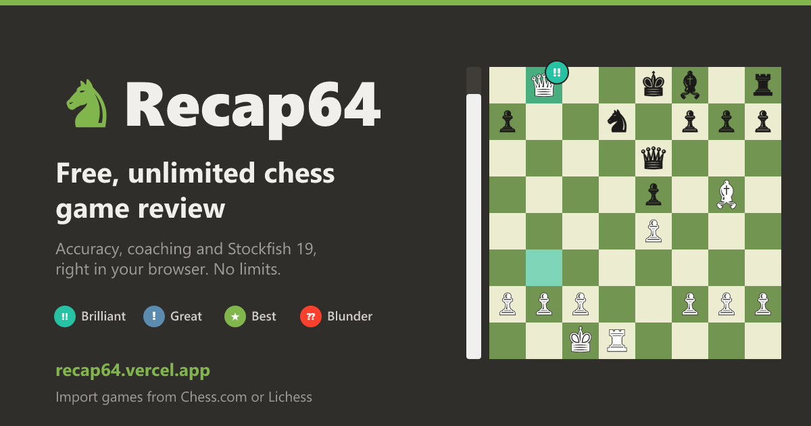

# ♞ Recap64

**▶ Use it now: [recap64.vercel.app](https://recap64.vercel.app)**

Recap64 is a free, unlimited, chess.com-style **Game Review** that runs entirely in your browser with Stockfish 19 (WebAssembly). No account, no server, no limits.



## Features

- **Import games**: paste a PGN, or fetch recent games by username from **Chess.com** or **Lichess** (public APIs)
- **Move classification**: Brilliant, Great, Best, Excellent, Good, Book, Forced, Inaccuracy, Mistake, Miss, Blunder
- **Accuracy score** per player, plus a count of each move type
- **Evaluation graph** (click to jump) and an **eval bar**
- **Coach comments** with the best move, an arrow on the board and the engine's best line
- **Best button**: replays the position with the engine's best move on the board, then steps through the follow-up line
- **Opening detection** (3,800+ named openings from the Lichess dataset)
- **Live engine** (top 3 lines) on any position
- **Try your own moves**: drag or click pieces to explore variations with live evaluation
- **Clock times** from the PGN's `[%clk]` tags (Chess.com and Lichess include them): both players' clocks at every move, time spent per move with bars in the move list, and the time control
- **Saved analyses**: finished reviews are stored in your browser (IndexedDB, last 100 games). A reload returns you to the same game and move, re-analyzing a saved game opens instantly, and the home screen lists saved games so you can reopen or delete them
- Keyboard: `←` `→` step, `↑`/`Home` start, `↓`/`End` end, `F` flip, `Esc` leave variation

## Run it

```bash
git clone https://github.com/SadmanInAction/Recap64.git
cd Recap64
npm install     # also copies the Stockfish engine files into public/stockfish
npm run dev     # open http://localhost:5173
```

Production build: `npm run build`, then `npm run preview`.

> **Speed:** the dev/preview servers send COOP/COEP headers, so the page is *cross-origin isolated* and uses the **multi-threaded** engine (all CPU cores). If you host `dist/` elsewhere, send the same two headers (`Cross-Origin-Opener-Policy: same-origin`, `Cross-Origin-Embedder-Policy: require-corp`). Without them the app still works, but falls back to a single thread.

## How the analysis works

1. Each position in the game is analysed with Stockfish (MultiPV 2, depth 12/16/20 with a per-position time cap).
2. Evaluations are converted to **win probability** with the Lichess model: `50 + 50·(2/(1+e^(−0.00368·cp)) − 1)`.
3. A move's **loss** = the mover's win % before minus after. Move accuracy = `103.17·e^(−0.0435·loss) − 3.17`.
4. **Classification** thresholds (win % lost): Excellent < 2, Good < 5, Inaccuracy < 10, Mistake < 20, Blunder ≥ 20.
   - **Best**: the engine's top move
   - **Great**: the only good move (the 2nd-best move is ≥ 20% worse)
   - **Brilliant**: a good move that sacrifices material (found by static exchange evaluation, or by material dropping in the engine line) without being already completely winning, unless the sacrifice forces mate
   - **Miss**: failing to punish the opponent's mistake or blunder
   - **Book**: consecutive opening moves found in the opening database
5. **Game accuracy** uses the Lichess method: a volatility-weighted mean averaged with the harmonic mean of move accuracies.

These heuristics approximate Chess.com's (unpublished) algorithm, so labels won't always match exactly.

## Project layout

```
src/
  engine/Engine.ts          UCI wrapper around the Stockfish Web Worker
  engine/useLiveEngine.ts   React hook for live MultiPV analysis
  analysis/analyze.ts       PGN parsing, full-game analysis pipeline, openings
  analysis/classify.ts      move classification, sacrifice detection, accuracy
  analysis/score.ts         eval → win %, formatting
  lib/importGames.ts        Chess.com / Lichess API clients
  components/               board + eval bar, graph, move list, summary, import screen
scripts/
  copy-stockfish.mjs        copies engine builds from node_modules (runs on install)
  build-openings.mjs        regenerates public/openings.json (`npm run openings`)
  build-notices.mjs         writes public/licenses.txt with third-party licences (runs on build)
```

## Privacy

Games are analyzed entirely in your browser and never uploaded. Saved analyses stay in your browser's storage. The site counts anonymous, cookie-free page views with [Vercel Web Analytics](https://vercel.com/docs/analytics/privacy-policy): only the home and review screens are recorded, never your games, moves or usernames.

## Licence

Recap64 is free software, licensed under the **GNU General Public License v3.0 or later**. See [LICENSE](LICENSE).

It's built on:
- [Stockfish](https://github.com/official-stockfish/Stockfish) via [Stockfish.js](https://github.com/nmrugg/stockfish.js) (GPLv3)
- [chess.js](https://github.com/jhlywa/chess.js) (BSD-2-Clause)
- [react-chessboard](https://github.com/Clariity/react-chessboard) (MIT)
- The [Lichess chess-openings](https://github.com/lichess-org/chess-openings) dataset (CC0)

The deployed site serves every third-party licence at [`/licenses.txt`](https://recap64.vercel.app/licenses.txt), generated at build time by `scripts/build-notices.mjs`.

Recap64 is an independent project and is not affiliated with, endorsed by, or connected to Chess.com or Lichess.
